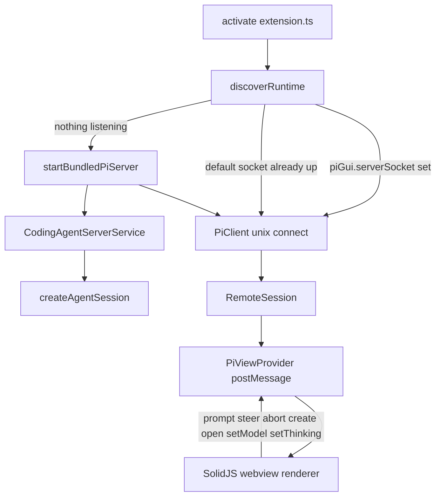
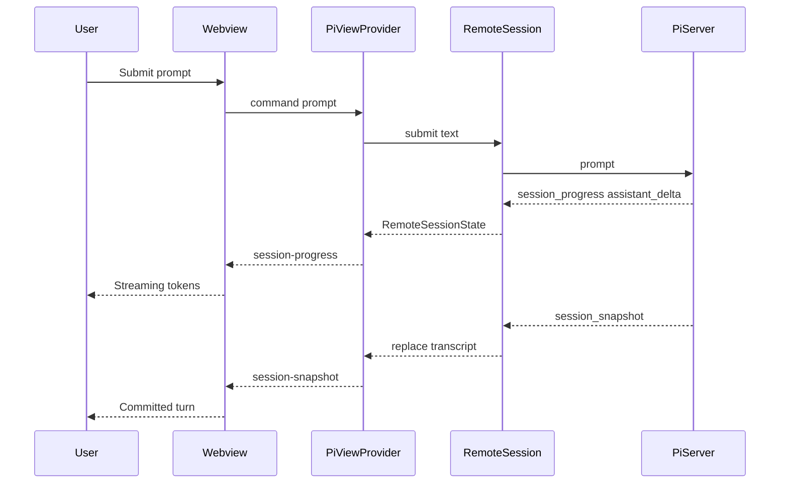
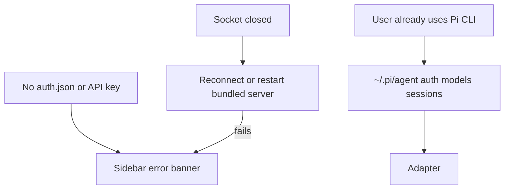

# Pi GUI VS Code extension

## System flow







## Problem overview

People who like OpenCode GUI’s sidebar want the same chrome for Pi, but that extension is a messy OpenCode SDK client living in the webview behind an HTTP/SSE proxy. Pi already has an experimental server protocol, a dumb `PiClient`, and `RemoteSession` transcript helpers. This repo should be a VS Code shell around that path, not a fork of OpenCode’s store.

## Solution overview

Ship a VS Code activity-bar sidebar that clones OpenCode GUI’s layout (session top bar, transcript, composer) while speaking only Pi protocol types. The extension bundles `@earendil-works/pi-coding-agent`, `pi-server`, and `pi-client`, so no separate CLI install is required. On activate it connects to an existing Unix socket if one is already up, otherwise it starts a bundled `PiServer` whose `PiServerService` wraps `createAgentSession` against the user’s `~/.pi/agent`. The webview is a renderer of `session_snapshot` plus `session_progress`; it never imports the coding-agent SDK.

## Goals

- Installing the extension is enough to open a working sidebar. No `pi` binary or global npm install.
- If a Pi server is already listening, connect to it. Always share `~/.pi/agent` (auth, models, sessions) and the workspace cwd with the CLI.
- Users see streaming tokens via `session_progress` `assistant_delta`. Snapshots replace committed transcript and must not be merged from progress.
- Clone OpenCode GUI chrome: session switcher, new session, message list with tool cards, send/stop/steer, model and thinking pickers, `@file` mentions, add-selection-to-prompt.
- Webview stays a renderer. Host stays a `PiClient`. Adapter stays the only coding-agent-aware module.
- Empty, connecting, disconnected, missing-key, and error states are visible in the sidebar.

## Non-goals

- OpenCode permission prompts, git-backed undo, subagent/task cards, OpenCode agents
- SDK, HTTP, or SSE inside the webview
- Copying OpenCode streamdown/remend, uikit playground, or standalone demo clutter
- Marketplace publish, or a full Pi login TUI (surface missing-key and point at `~/.pi/agent`)
- Requiring `pi` on PATH, spawning the CLI as the runtime, or a public `pi serve` CLI
- An extension-only agent directory that would split CLI and GUI sessions
- `pi --mode rpc` or the unmerged `pi web` PR

## Important files, docs, and websites

- [saffron-health/opencode-gui](https://github.com/saffron-health/opencode-gui) — Visual chrome to clone; architecture to avoid.
- [pi-protocol README](https://github.com/earendil-works/pi/blob/main/packages/protocol/README.md) — Snapshots are authoritative; progress events are transient UI hints.
- [pi-client README](https://github.com/earendil-works/pi/blob/main/packages/client/README.md) — `PiClient` + `@earendil-works/pi-client/unix`.
- [pi-server README](https://github.com/earendil-works/pi/blob/main/packages/server/README.md) — `createUnixServer(service, { path })`; apps supply `PiServerService`.
- [pi-coding-agent SDK](https://github.com/earendil-works/pi/blob/main/packages/coding-agent/docs/sdk.md) — `createAgentSession`, `SessionManager.list`, `ModelRuntime`.
- [`@earendil-works/pi-coding-agent/client`](https://github.com/earendil-works/pi/blob/main/packages/coding-agent/src/client/remote-session.ts) — `RemoteSession`, `applyTranscriptSnapshot`, `applyTranscriptProgress`.
- [`src/shared/messages.ts`](../src/shared/messages.ts) — Host↔webview contract (this repo).
- [`src/host/runtime.ts`](../src/host/runtime.ts) — Discovery and bundled server lifecycle.
- [`src/host/adapter.ts`](../src/host/adapter.ts) — `CodingAgentServerService`.
- [`src/webview/App.tsx`](../src/webview/App.tsx) — Sidebar chrome.

## Implementation

### Phase 1: Scaffold the extension and OpenCode-like chrome

Leave a loadable VS Code webview that looks like OpenCode GUI (top bar, empty transcript, composer) with no Pi connection yet.

```callstack
 vscode.activate
+└── PiViewProvider.resolveWebviewView
+    └── webview.html
+        └── App
+            ├── TopBar
+            ├── MessageList (empty)
+            └── InputBar
```

```diff:src/extension.ts
+import * as vscode from "vscode";
+import { PiViewProvider } from "./PiViewProvider";
+
+export function activate(context: vscode.ExtensionContext) {
+  const provider = new PiViewProvider(context);
+  context.subscriptions.push(
+    vscode.window.registerWebviewViewProvider(PiViewProvider.viewType, provider, {
+      webviewOptions: { retainContextWhenHidden: true },
+    }),
+  );
+}
```

- [ ] Add `package.json` (pnpm, `pi-gui` view container, Vite dual-build scripts, `engines.vscode` ^1.96.0), `vite.config.extension.ts`, `vite.config.ts`, `.vscode/launch.json`, README.
- [ ] Add `src/extension.ts`, `src/PiViewProvider.ts`, SolidJS `src/webview/App.tsx` with TopBar / empty MessageList / InputBar, `App.css` using VS Code theme tokens like OpenCode GUI.
- [ ] Show an empty-state line in the transcript (“Start a session to talk to Pi”).
- [ ] Run `pnpm build`.
- [ ] Run `pnpm test` once the test runner exists; until then `pnpm build` is the repo check.

### Phase 2: Typed host↔webview relay

Replace ad-hoc `postMessage` with zod-validated commands and events whose payloads are Pi protocol types (or a thin status envelope). No sockets yet: host answers `ready` with `status: "connecting"`.

```callstack
 webview vscode.postMessage
-└── untyped host handler
+└── parseWebviewMessage
+    └── PiViewProvider.handleCommand
+        └── postHostMessage (status | error)
```

```diff:src/shared/messages.ts
+export const WebviewMessageSchema = z.discriminatedUnion("type", [
+  z.object({ type: z.literal("ready") }),
+  z.object({ type: z.literal("prompt"), text: z.string() }),
+  z.object({ type: z.literal("steer"), text: z.string() }),
+  z.object({ type: z.literal("abort") }),
+  z.object({ type: z.literal("new-session") }),
+  z.object({ type: z.literal("open-session"), sessionId: z.string() }),
+  z.object({ type: z.literal("set-model"), provider: z.string(), id: z.string() }),
+  z.object({ type: z.literal("set-thinking"), level: z.string() }),
+  z.object({ type: z.literal("search-files"), query: z.string() }),
+  z.object({ type: z.literal("open-file"), path: z.string() }),
+]);
```

- [ ] Add `src/shared/messages.ts` with `parseHostMessage` / `parseWebviewMessage`. Host events: `status`, `error`, `server-snapshot` (sessions + models), `session-snapshot`, `session-progress`, `search-files-result`, `editor-selection`.
- [ ] Wire `PiViewProvider` to parse inbound messages and reply to `ready`.
- [ ] Webview `App` stores last status and renders connecting/error banners from host messages.
- [ ] Add `src/shared/messages.test.ts` covering valid/invalid round-trips.
- [ ] Run `pnpm test -- src/shared/messages.test.ts`.
- [ ] Run `pnpm test && pnpm build`.

### Phase 3: Bundled PiServer, discovery, and PiClient

On activate, discover a Unix socket, start a bundled server only if needed, and connect with `PiClient`. Push connection status into the webview.

```callstack
 activate
-└── PiViewProvider (static html)
+└── createPiRuntime
+    ├── resolveSocketPath (setting or ~/.pi/agent/gui.sock)
+    ├── tryConnect existing socket
+    └── else startBundledServer
+        ├── CodingAgentServerService
+        ├── createUnixServer
+        └── PiClient + createUnixTransportFactory
```

```diff:src/host/runtime.ts
+export async function createPiRuntime(options: RuntimeOptions): Promise<PiRuntime> {
+  const socketPath = options.configuredSocket ?? defaultSocketPath();
+  if (await isSocketListening(socketPath)) {
+    return connectClient(socketPath, { startedServer: false });
+  }
+  const service = await CodingAgentServerService.create({
+    cwd: options.cwd,
+    agentDir: getAgentDir(),
+  });
+  const server = createUnixServer(service, { path: socketPath });
+  await server.start();
+  return connectClient(socketPath, { startedServer: true, server, service });
+}
```

- [ ] Implement `src/host/discovery.ts` (`defaultSocketPath`, `isSocketListening`) and `src/host/adapter.ts` (`CodingAgentServerService` wrapping `createAgentSession` / `SessionManager.list` / `ModelRuntime.getAvailable`).
- [ ] Map `AgentSession` events to `PiSessionRuntime` snapshots and `TranscriptProgress` (`assistant_delta` from `text_delta` / `thinking_delta`). Use `getAgentDir()` so auth and sessions stay in `~/.pi/agent`.
- [ ] `src/host/runtime.ts` follows setting → existing socket → bundled start. Dispose stops a server only if this process started it.
- [ ] Host posts `status: "connected" | "disconnected"` and a missing-key `error` when `listModels()` has no authenticated model.
- [ ] Run `pnpm test -- src/host/discovery.test.ts` (socket path + “already listening” skip-start).
- [ ] Run `pnpm test && pnpm build`.

### Phase 4: Sessions list, create, and switch

Bind `RemoteSession` to the webview session switcher. Persist the last session id per workspace.

```callstack
 App TopBar
-└── local empty sessions array
+└── host server-snapshot.sessions
+    └── onNewSession -> command new-session
+    └── onSelect -> command open-session
+        └── RemoteSession.create / open
+            └── session-snapshot
```

```diff:src/PiViewProvider.ts
+private async handleNewSession() {
+  await this.remote?.dispose();
+  this.remote = await RemoteSession.create(this.client, { cwd: this.cwd });
+  this.bindRemote(this.remote);
+}
```

- [ ] On connect, `RemoteSession` from `@earendil-works/pi-coding-agent/client` is created or opened (last id in `workspaceState`, else new).
- [ ] Forward `client.snapshot.sessions` / `models` as `server-snapshot`. Subscribe to session snapshots and progress.
- [ ] TopBar `SessionSwitcher` + `NewSessionButton` drive `open-session` / `new-session`. Empty transcript still shows the empty state until messages exist.
- [ ] Add a test that `parseWebviewMessage` accepts `open-session` / `new-session`.
- [ ] Run `pnpm test && pnpm build`.

### Phase 5: Prompt and streaming transcript

Submitting the composer streams tokens into the message list. A later snapshot replaces the streaming bubble.

```callstack
 InputBar onSubmit
-└── noop
+└── postMessage prompt
+    └── RemoteSession.submit
+        ├── onEvent session_progress -> MessageList streaming text
+        └── subscribe snapshot -> selectTranscript replace
```

```diff:src/webview/App.tsx
+const onSubmit = () => {
+  const text = draft().trim();
+  if (!text) return;
+  if (phase() === "idle") vscode.postMessage({ type: "prompt", text });
+  else vscode.postMessage({ type: "steer", text });
+  setDraft("");
+};
```

- [ ] Host maps `prompt` / `steer` to `RemoteSession.submit` (it already chooses prompt vs steer from phase).
- [ ] Webview keeps `TranscriptState` via `createTranscriptState` / `applyTranscriptProgress` / `applyTranscriptSnapshot` (copy the helpers into `src/webview/transcript.ts` if the webview cannot import the Node package).
- [ ] `MessageList` renders user text, assistant markdown, and thinking blocks. Streaming assistant items use `status: "streaming"`.
- [ ] Cover `applyTranscriptProgress` for an `assistant_delta` in `src/webview/transcript.test.ts` if helpers are vendored; otherwise skip and rely on the package.
- [ ] Run `pnpm test && pnpm build`.

### Phase 6: Tool cards, abort, and steer queue

Show Pi’s four tools as cards. Stop aborts. Composer switches to steer while `phase === "turn"`, and queued steers render as chips.

```callstack
 MessageItem
-└── text/thinking only
+└── ToolCard for toolCall / tool result
 InputBar
-└── Send only
+└── Send | Stop | Steer (phase turn)
+└── queuedSteer chips
```

```diff:src/webview/components/ToolCard.tsx
+export function ToolCard(props: { name: string; input: unknown; output?: string; status: string }) {
+  // read / edit / write / bash get a titled card; anything else uses Generic
+}
```

- [ ] Render `toolCall` content and tool-role transcript items. `read` / `edit` / `write` / `bash` get dedicated titles and collapsed output; others use a generic card.
- [ ] Empty composer while running shows Stop (`abort`). Non-empty while running shows Steer.
- [ ] Render `snapshot.queuedSteer` as dismissible-looking chips (display only; dequeue is a later non-goal if the protocol lacks it).
- [ ] Clicking a file path in a read/edit card sends `open-file`.
- [ ] Run `pnpm test && pnpm build`.

### Phase 7: Model, thinking, and file context

Replace OpenCode’s agent switcher with Pi model + thinking pickers. `@` in the composer searches workspace files. Editor selection can be inserted into the prompt.

```callstack
 InputBar
+├── ModelPicker -> set-model
+├── ThinkingPicker -> set-thinking
+└── @query -> search-files -> mention chip
 editor/context menu
+└── piGui.addSelectionToPrompt -> editor-selection
```

```diff:package.json
+{
+  "contributes": {
+    "commands": [{ "command": "piGui.addSelectionToPrompt", "title": "Add Selection to Prompt" }]
+  }
+}
```

- [ ] Pickers read `server-snapshot.models` and current `session-snapshot.model` / `thinkingLevel`. Unauthenticated models stay visible but selecting one that cannot run surfaces the missing-key banner.
- [ ] Host `search-files` uses `vscode.workspace.findFiles` (or `git ls-files` when in a repo) and returns relative paths.
- [ ] Command `piGui.addSelectionToPrompt` posts `editor-selection` with path and line range; composer inserts `@path#Lstart-Lend`.
- [ ] Run `pnpm test && pnpm build`.

### Phase 8: Polish states and README

Make disconnected / missing-key / empty / busy states obvious. Document F5, no-CLI install, and reuse of `~/.pi/agent`.

```callstack
 App
-└── transcript + composer only
+└── StatusBanner (connecting | disconnected | missing-key | error)
```

```diff:README.md
+Installing this extension is enough. It bundles Pi and starts a local server.
+If you already use the Pi CLI, the sidebar shares `~/.pi/agent` and will
+connect to an existing GUI socket instead of starting a second server.
```

- [ ] Status banner for connecting, disconnected, and missing API key (mention `ANTHROPIC_API_KEY` / `~/.pi/agent/auth.json`).
- [ ] README: `pnpm install`, `pnpm build`, `pnpm watch`, F5, settings `piGui.serverSocket`.
- [ ] `.vscodeignore` includes the VSIX runtime (`dist`, `out`, `node_modules/@earendil-works`).
- [ ] Run `pnpm test && pnpm build`.
- [ ] Manual check: empty sidebar, then with a key, one prompt streams and a tool card appears.
